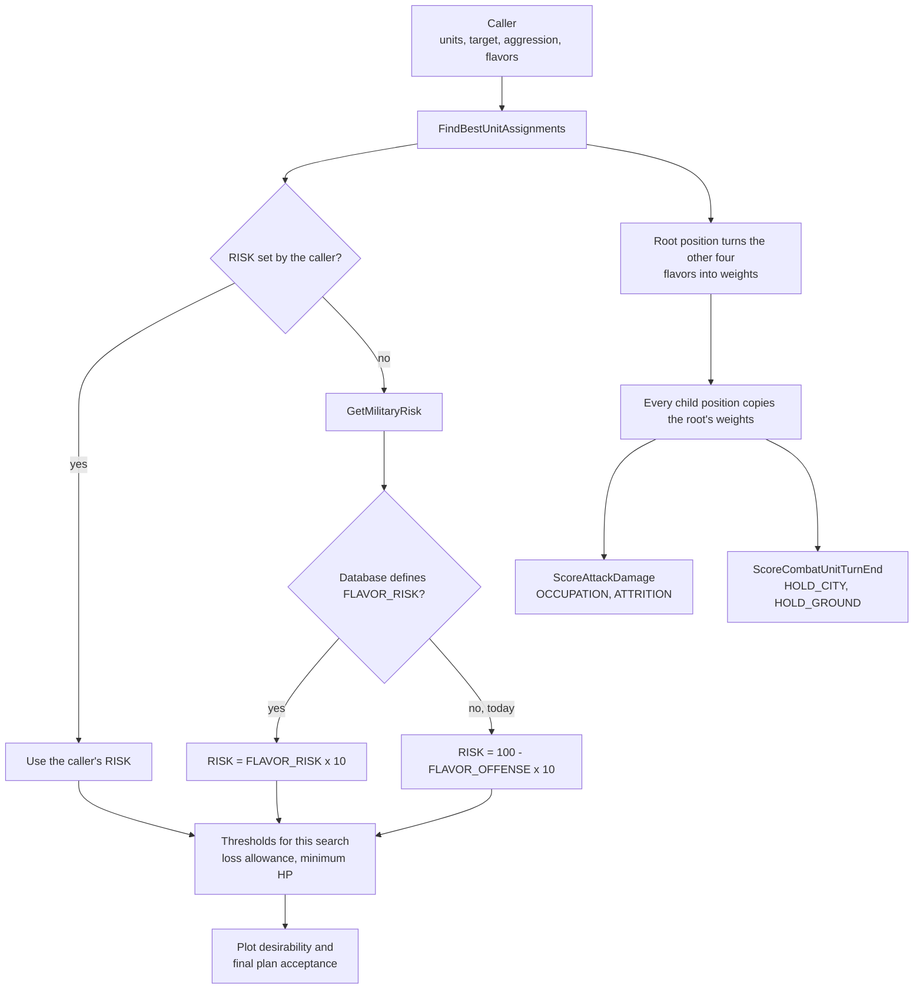
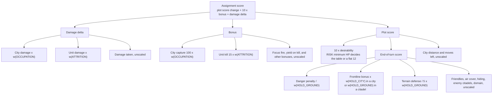

# Unit AI: Military Tactical Flavors

**Military tactical flavors** are five 0 to 100 dials that change how [tactical simulation](military-tactical-simulation.md) judges a plan. They don't add new moves or remove safety checks. They change how much the search cares about cities, enemy units, its own cities, contested ground, and losses. As a result, a different plan can win among the moves the search would already consider.

All five flavors are neutral at 50. At neutral, the search returns exactly the plans it returned before flavors existed. Today, live play leaves the four scoring flavors at 50 and gets RISK from the leader's offense flavor, so live behavior matches stock Vox Populi. The tactical simulator in `vox-deorum-rl` sets other values to compare what different flavors would do.

The code is in `civ5-dll/CvGameCoreDLL_Expansion2/CvTacticalAI.cpp` and `CvTacticalAI.h`: the `STacticalFlavors` struct, `TacticalAIHelpers::GetMilitaryRisk`, and `CvTacticalPosition::scaleByFlavor`.

## The five flavors

| Flavor | Question it answers | How it acts | Higher value means |
| --- | --- | --- | --- |
| **RISK** | How many losses and how much damage will we accept? | Sets two thresholds | More caution |
| **OCCUPATION** | How much do cities matter as targets? | Weights score terms | Cities count more |
| **ATTRITION** | How much does damaging enemy units matter? | Weights score terms | Enemy units count more |
| **HOLD_CITY** | How much should units stay in our threatened cities? | Weights a score term | More units stay in the city |
| **HOLD_GROUND** | How much should units stand on contested, defensible plots? | Weights score terms | Units stand their ground more |

RISK is the odd one out. It doesn't change any score. It sets the loss allowance and the minimum HP for units joining the attack line before the search starts. The other four flavors multiply specific score terms.

## Where flavors enter the search

A caller that passes no flavors gets the neutral default: four weights of exactly 1 and an unset RISK. That is the case for every live caller.

## Scoring flavors: the weight curve

Each scaled term is multiplied by a weight that doubles for every 50 points above neutral and halves for every 50 points below it:

`weight = 2 ^ (strength x (flavor - 50) / 50)`

| Flavor value | 0 | 25 | 50 | 75 | 100 |
| --- | --- | --- | --- | --- | --- |
| Weight at strength 1 | 0.5 | 0.71 | 1 | 1.41 | 2 |
| Weight at strength 2 | 0.25 | 0.5 | 1 | 2 | 4 |

- **Strength** sets how far the extremes reach. It defaults to 1, and only a caller such as the simulator changes it.
- **Neutral is exact.** A weight of exactly 1 returns the term untouched, with no rounding, so neutral scores match stock scores bit for bit.
- **Rounding.** The weight is stored in thousandths, and scaled terms round half away from zero.
- **Inverse terms.** A term marked inverse is divided by the weight instead of multiplied. The danger penalty is the only one.

## Scoring rules side by side

This section restates the [stock scoring rules](military-tactical-simulation.md#scoring) with the flavored version next to each one. In the formulas, `w(X)` means the weight of flavor X. At 50 every `w(X)` is 1, so each flavored rule reduces to the stock rule.

### Where the weights land

### The assignment score

Both versions combine an assignment the same way, in `STacticalAssignment::SetScore`:

`assignment score = new plot score - old plot score + 10 x (bonus + damage delta)`

Flavors change what goes into the three parts, not how they're combined. Damage and bonuses count ten times as much as plot score changes, so a weight on an attack term moves the score about ten times as much as the same weight on a plot term.

### Attacks: `ScoreAttackDamage`

| Part | Stock rule | Flavored rule |
| --- | --- | --- |
| Damage delta | city damage + unit damage - damage taken | city damage x w(OCCUPATION) + unit damage x w(ATTRITION) - damage taken |
| Kill bonus | +100 for a city capture, or +15 for a unit kill | +100 x w(OCCUPATION) for a city capture, or +15 x w(ATTRITION) for a unit kill |
| Focus fire bonus | 30 - the target's HP after the attack, kept between 0 and the damage dealt | Same |
| Other bonuses | +20 when the kill grants yields, -10 for a score reduction, splash and kill effects | Same |
| Melee trade veto | Cancels a non-killing melee attack whose aggression-weighted trade is bad and leaves the unit too weak or exposed | Same, using unscaled damage |

City damage is capped at the city's HP plus a small overkill allowance, and unit damage at the unit's remaining HP. The weights apply after these caps.

### Positions: `ScorePlotForCombatUnitMove` and `ScoreCombatUnitTurnEnd`

`plot score = 10 x desirability + end-of-turn score + city distance + moves left`

| Part | Stock rule | Flavored rule |
| --- | --- | --- |
| Desirability, with enemies present | Line-distance table by movement strategy, or a flat 12 in a friendly city or when HP is below the minimum HP | Same table. The minimum HP comes from RISK. |
| Danger penalty | danger x the danger weight setting / current HP, flattened above 225, adjusted for experience, doubled with no adjacent friendly | The same penalty / w(HOLD_GROUND) |
| Frontline bonus | +67 in our own city or citadel within two plots of an enemy, or +33 in the weaker case | +67 or +33 x w(HOLD_CITY) in a city, x w(HOLD_GROUND) in a citadel |
| Terrain defense | defense modifier / 5 | defense modifier / 5 x w(HOLD_GROUND) |
| Other end-of-turn terms | Adjacent friendlies, air cover, hiding from the enemy, occupying enemy citadels, being outside the native domain | Same |
| City distance and moves left | Small tiebreakers | Same |

The end-of-turn score applies only when a unit ends its turn on the plot. An intermediate move uses a simpler danger estimate, and no flavor scales it.

### Plan acceptance: `addFinishMovesIfAcceptable`

| Part | Stock rule | Flavored rule |
| --- | --- | --- |
| Units allowed on unacceptable plots | allowance + enemies killed, counting only units below median experience | Same |
| Allowance | 1 when offense is above 6 and more than six units take part, otherwise 0 | 1 when RISK is 30 or less and more than six units take part, otherwise 0 |
| Minimum HP | 50 - 2 x offense | 30 + RISK / 5 |

With RISK = 100 - 10 x offense, both rows give the same values.

## Values at the extremes

| Flavor | Function | Term | Stock value | At 0 | At 100 |
| --- | --- | --- | --- | --- | --- |
| OCCUPATION | `ScoreAttackDamage` | Damage dealt to a city | As forecast | Half | Double |
| OCCUPATION | `ScoreAttackDamage` | City capture bonus | +100 | +50 | +200 |
| ATTRITION | `ScoreAttackDamage` | Damage dealt to units | As forecast | Half | Double |
| ATTRITION | `ScoreAttackDamage` | Unit kill bonus | +15 | +8 | +30 |
| HOLD_CITY | `ScoreCombatUnitTurnEnd` | Frontline bonus for ending in our own city | +67, or +33 in the weaker case | +34 or +17 | +134 or +66 |
| HOLD_GROUND | `ScoreCombatUnitTurnEnd` | Frontline bonus for ending in our own citadel | +67, or +33 in the weaker case | +34 or +17 | +134 or +66 |
| HOLD_GROUND | `ScoreCombatUnitTurnEnd` | Terrain defense (defense modifier / 5) | +5 on a 25% hill | +3 | +10 |
| HOLD_GROUND | `ScoreCombatUnitTurnEnd` | Danger penalty (inverse) | -60 for example | -120 | -30 |

The frontline bonus applies to a land unit ending its turn in our own city or citadel within two plots of an enemy. A ranged unit, a unit with no adjacent friendly land unit, or a unit next to an enemy gets the full bonus. Otherwise the unit gets half.

### Example: choosing a target

An archer can shoot a city for 20 damage or an adjacent spearman for 25. Neither shot kills.

| Flavors | City shot | Spearman shot | Choice |
| --- | --- | --- | --- |
| All 50 (stock) | 20 | 25 | Spearman |
| OCCUPATION 100 | 40 | 25 | City |
| ATTRITION 0 | 20 | 13 | City |
| ATTRITION 100 | 20 | 50 | Spearman, by a wider margin |

### Example: holding a plot

A unit could end its turn on a hill with a danger penalty of 60, or retreat to a safe plot.

| HOLD_GROUND | 0 | 50 | 100 |
| --- | --- | --- | --- |
| Danger penalty | -120 | -60 | -30 |
| Hill defense term | +3 | +5 | +10 |
| Net on the hill | -117 | -55 | -20 |

At 100, the hill can beat a retreat it would lose to under stock scoring. At 0, units pull back sooner. HOLD_CITY makes the same trade for a threatened city. At 100 a unit keeps the city over a forward plot. At 0 it may leave the city to a weaker unit, or leave it empty.

## RISK: thresholds instead of weights

RISK sets two values once per search:

| Value | Rule | What it controls |
| --- | --- | --- |
| **Loss allowance** | 1 when RISK is 30 or less and more than six units take part, otherwise 0 | When a finished plan leaves units on unacceptable plots, the plan can still pass if those units are below median experience. The number allowed is this allowance plus the number of enemies the plan kills. |
| **Minimum HP** | 30 + RISK / 5 | A unit below this HP stops following the line-distance table. Every plot gets the same top desirability, so danger and other terms decide where it stands instead of the pull toward the enemy. |

| RISK | 0 | 30 | 50 | 70 | 100 |
| --- | --- | --- | --- | --- | --- |
| Loss allowance (more than six units) | 1 | 1 | 0 | 0 | 0 |
| Minimum HP | 30 | 36 | 40 | 44 | 50 |

### Where RISK comes from

| Source | When it applies | Value |
| --- | --- | --- |
| The caller | The caller sets RISK (the simulator does) | The caller's value |
| `FLAVOR_RISK` | The caller leaves RISK unset and the database defines `FLAVOR_RISK` | The leader's `FLAVOR_RISK` x 10 |
| `FLAVOR_OFFENSE` | The caller leaves RISK unset and the database doesn't define `FLAVOR_RISK` (the current setup) | 100 - the leader's `FLAVOR_OFFENSE` x 10 |

Leader flavors are read through `GetPersonalityAndGrandStrategy`, so [Vox Deorum custom flavors](concepts.md#flavors) apply when they are active. The offense fallback reproduces the stock Vox Populi thresholds exactly. Stock Vox Populi allows one loss when offense is above 6 and sets the minimum HP to 50 - 2 x offense. Offense 7 becomes RISK 30, and offense 5 becomes RISK 50 with a minimum HP of 40.

## What flavors don't change

- **Hard gates.** Death-trap checks, edge-of-vision checks, the melee trade veto, and the final extreme-danger block work as they did before. A flavor can make a plot more attractive, but it can't make a forbidden plot legal.
- **Aggression.** The caller's [aggression level](military-tactical-simulation.md#entry-points-and-aggression) still decides which attacks are allowed and how much provisional danger is tolerated.
- **Other score terms.** The intermediate-move citadel and pillage bonuses, focus fire, the line-distance table, and the other bonuses stay unscaled.
- **What the search explores.** Search bounds, the 13-unit limit, duplicate pruning, and replay don't change. Flavors only change scores and the RISK thresholds.
